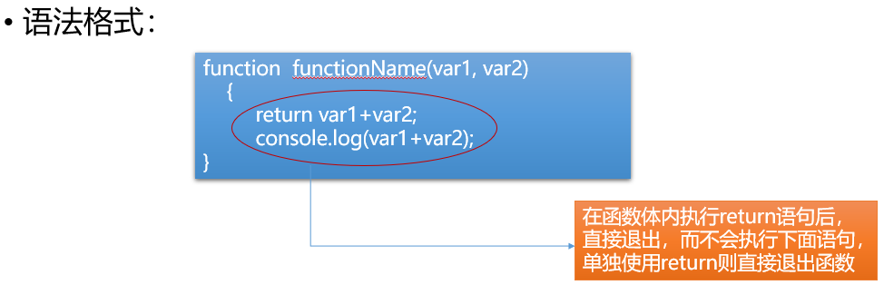
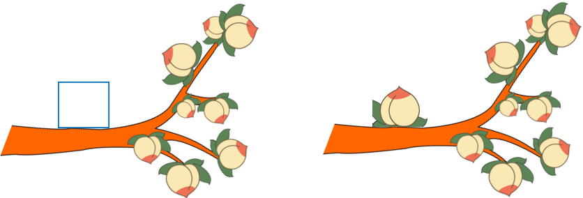

# JavaScript大纲

[TOC]
## 一、 JavaScript 概述

 ### 1. JavaScript概念

#### 1) JS 介绍

简称JS，是一种浏览器解释型语言,嵌套在HTML文件中交给浏览器解释执行。主要用来实现网页的动态效果，用户交互及前后端的数据传输等。

#### 2) JS 组成

1. 核心语法 -ECMAScript 规范了JS的基本语法
2. 浏览器对象模型 -BOM
   Browser Object Model，提供了一系列操作浏览器的方法
3. 文档对象模型 -DOM
   Document Object Model ，提供了一系列操作的文档的方法

### 2. 使用方式

1. 元素绑定事件

   + 事件 ：指用户的行为（单击，双击等）或元素的状态（输入框的焦点状态等）
   + 事件处理：元素监听某种事件并在事件发生后自动执行事件处理函数。
   + 常用事件：onclick (单击事件) 
   + 语法 ：将事件名称以标签属性的方式绑定到元素上，自定义事件处理。

   ```html
   <!--实现点击按钮在控制台输出-->
   <button onclick="console.log('Hello World');">点击</button>
   ```

2. 文档内嵌。使用<script type="text/javascript"></script>标签书写 JS 代码

   + 语法 ：

   ```html
   <script type="text/javascript">
     alert("网页警告框");
   </script>
   ```

   + 注意 ：<script></script>标签可以书写在文档的任意位置，书写多次，一旦加载到script标签就会立即执行内部的JS代码，因此不同的位置会影响代码最终的执行效果

3. 外部链接

   + 创建外部的JS文件 XX.js，在HTML文档中使用<script src=""></script>引入

   ```html
   <script src="index.js"></script>
   ```

   + 注意 ：<script></script>既可以实现内嵌 JS 代码，也可以实现引入外部的 JS 文件，但是只能二选一。

## 二、基础语法

### 1. 语法规范

1. JS是由语句组成,语句由关键字,变量,常量,运算符,方法组成.分号可以作为语句结束的标志,也可以省略
2. JS严格区分大小写
3. 注释语法
   单行注释使用 //
   多行注释使用 /* */

### 2. JS的变量与常量

#### 1)  变量

1. 作用 : 用于存储程序运行过程中可动态修改的数据

2. 语法 : 使用关键var声明,自定义变量名

   ```javascript
   var a;		//变量声明
   a = 100;	//变量赋值
   var b = 200; //声明并赋值
   var m,n,k;	//同时声明多个变量
   var j = 10,c = 20; //同时声明并赋值多个变量
   ```

3. 命名规范 : 

   + 变量名,常量名,函数名,方法名自定义,可以由数字,字母,下划线,$组成,禁止以数字开头
   + 禁止与关键字冲突(var const function if else for while do break case switch return class)
   + 变量名严格区分大小写
   + **变量名尽量见名知意,多个单词组成采用小驼峰,例如："userName"**

4. 使用注意 :

   + 变量如果省略var关键字,并且未赋值,直接访问会报错
   + 变量使用var关键字声明但未赋值,变量初始值为undefined
   + 变量省略var关键字声明,已被赋值,可正常使用.影响变量作用域

#### 2)  常量 

1. 作用 : 存储一经定义就无法修改的数据

2. 语法 : 必须声明的同时赋值

   ```javascript
   const PI = 3.14;
   ```

3. 注意 :

   + 常量一经定义,不能修改,强制修改会报错
   + 命名规范同变量,为了区分变量,常量名采用全大写字母

```html
<!DOCTYPE html>
<html lang="en">
<head>
    <meta charset="UTF-8">
    <meta name="viewport" content="width=device-width, initial-scale=1.0">
    <meta http-equiv="X-UA-Compatible" content="ie=edge">
    <title>JS的使用方式</title>
</head>
<body>
    <button onclick="alert('hello world')">
        click me!
    </button>
    <script>
        // js代码
        // 在浏览器控制台输出一段内容 类似print
        // console.log('hello world');

        var a;
        a = 10;
        var b = 20;
        var a,b,c;
        var a=10,b=20;
        var $name;

        const PI = 3.14;

        // var a = undefined;
        var a = null;
        a = 10;
   </script>
    <script src="demo.js"></script>
</body>
</html>
```


### 3. 数据类型

#### 1) 基本数据类型（简单数据类型）

1. number 数值类型

   + 整数

     1.   十进制表示

       ```javascript
        var a = 100;
       ```

     2. 八进制表示
         以0为前缀

       ```javascript
        var b = 021; //结果为十进制的 17
       ```

     3. 十六进制
          以0x为前缀

       ```javascript
        var c = 0x35;//结果为十进制的 53
       ```

     使用 : 整数可以采用不同进制表示,在控制台输出时一律会按照十进制输出

   + 小数

     1. 小数点表示

     ```javascript
      var m = 1.2345;
     ```

     2. 科学计数法

        例 : 1.5e3
         e表示10为底,e后面的数值表示10的次方数

        1.5e3 等价于 1.5 * 10(3)

2. string 字符串类型
   字符串 : 由一个或多个字符组成,使用""或''表示,每一位字符都有对应的Unicode编码

   ```javascript
   var s = "100";
   var s1 = "张三";
   ```


3. boolean 布尔类型
   只有真和假两个值，布尔值与number值可以互相转换。true 为 1，false 为 0

   ```javascript
   var isSave = true;
   var isChecked = false;
   ```

4. undefined  (程序返回的值)
   特殊值,变量声明未赋值时显示undefined

   ```javascript
   var a;
   console.log(a);//undefined
   ```

5. null 空类型  (主动使用的)
   解除对象引用时使用null,表示对象为空

#### 2) 引用数据类型

主要指对象，函数等

#### 3) 检测数据类型

typeof  变量或表达式
typeof (变量或表达式)


```javascript
var n = "asda";
console.log(typeof n);//string
console.log(typeof(n));//string
```

### 4. 数据类型转换

不同类型的数据参与运算时,需要转换类型

#### 1) 强制类型转换

1. 转换字符串类型
   方法 : toString()
   返回转换后的字符串

 ```javascript
 var a = 100;
 a = a.toString(); //"100"
 var b = true;
 b = b.toString(); //"true"
 ```

2. 转换number类型

   + Number(param)
     参数为要进行数据类型转换的变量或值，返回转换后的结果:
     	

     如果转换成功,返回number值
     	

     如果转换失败,返回NaN,(Not a Number)，只要数据中存在非number字符,一律转换失败，返回 NaN

   ```javascript
       Number("abc")  //typeof NaN
       Number(undefined) //typeof NaN
       Number(null) //0 null在做比较运算时不转换为数值类型
   ```
   
+ parseInt(param)
     参数为要解析的数据
         
     作用 : 从数据中解析整数值
         
     过程 :
   
  1.如果参数为非字符串类型,会自动转成字符串
  
  2.左向右依次对每一位字符转number,转换失败则停止向后解析,返回结果
  
+ parseFloat(param)
  
  作用 : 提取number值，包含整数和小数部分

#### 2) 隐式类型转换（自动转换）

1. 当字符串与其他数据类型进行**"+"**运算时,表示字符串的拼接，不再是数学运算

转换规则 ：将非字符串类型的数据转换成字符串之后进行拼接，最终结果为字符串

2. 其他情况下**(-*/%)**，一律将操作数转number进行数学运算

```html
<!DOCTYPE html>
<html lang="en">
<head>
    <meta charset="UTF-8">
    <meta name="viewport" content="width=device-width, initial-scale=1.0">
    <meta http-equiv="X-UA-Compatible" content="ie=edge">
    <title>类型转换</title>
</head>
<body>
    <script>
       	//强制转换   任意类型-->string
        // var a = 10;
        // var str_a = a.toString();
        // console.log(str_a,10);
        // // console.log(10.toString())
        // console.log(true.toString())

				//强制转换   任意类型-->number
        // console.log(Number('123'))
        // console.log(Number('123.456'))
        // console.log(Number('123abc'))//NaN
      	// console.log(Number(undefined))//NaN  
      	// console.log(Number(true))//1
        // console.log(Number(false))//0
      	// console.log(Number(null))//0

        // console.log(parseInt('123abc')) //123
        // console.log(parseInt('123.456')) //123
        // console.log(parseInt(123.456)) //123
        // console.log(parseFloat('123.456')) //123.456
        // console.log(parseFloat('123.456.789')) //123.456 
      	
      	// 隐式转换
        console.log('10'+1);
        // '10' +  '1'  =  '101'

        console.log('10'-1);
        // 10 - 1 = 9

        // 接收用户输入的一个数值 将数值加10后打印
        // var num = prompt('请输入一个数值');
        // console.log(parseInt(num)+10);

        var age = 18; //假装从服务器获取的数据
        //显示 QTX的年龄为xx
        console.log('QTX的年龄为'+age);

        console.log(age+''); //'18'
        console.log('10'-true); //10 - 1
    </script>
</body>
</html>
```

### 5. 运算符

#### 1) 赋值运算符 

	= 将右边的值赋给左边变量

#### 2) 算数运算符

	+ - * / %  加 减 乘 除 取余

#### 3) 复合运算符

	+= -= *= /= %=

#### 4) 自增或自减运算符

	++ -- 变量的自增和自减指的是在自身基础上进行 +1或-1 的操作

注意：

+ 自增或自减运算符在单独与变量结合时，放前和放后没有区别
+ 如果自增或自减运算符与其他运算符结合使用，要区分前缀和后缀,
  + 做前缀，那就先++/--,再进行赋值或其他运算，
  + 如果做后缀，就先结合其他运算符，再进行++ / --

#### 5) 关系运算符/比较运算符

	> <     
	>= <=
	==(相等) !=(不相等)
	===(全等) !==(不全等)

1. 关系运算符用来判断表达式之间的关系,结果永远是布尔值 true/false

2. 使用

   + 字符串与字符串之间的比较
     依次比较每位字符的Unicode码,只要某位字符比较出结果,就返回最终结果
   + 其他情况
     一律将操作数转换为number进行数值比较，如果某一操作数无法转换number，则变成NaN参与比较运算，结果永远是false
  + null和其他数据类型做等值比较运算 不转换成数字
     + null和undefined相等 但是 null和undefined不全等


3. 相等与全等
   + 相等 : 不考虑数据类型,只做值的比较(包含自动类型转换)
   + 全等 : 不会进行数据类型转换,要求数据类型一致并且值相等才判断全等

#### 6) 逻辑运算符 

1. && 逻辑与  条件1&&条件2  (and)

   表达式同时成立,最终结果才为true;全1则1

2. || 逻辑或  条件1||条件2   (or)

   表达式中只要有一个成立,最终结果即为true; 有1则1

3. ! 逻辑非    !条件  (not)

   对已有表达式的结果取反
   注意 : 除零值以外,所有值都为真

#### 7) 三目运算符

语法 :

```text
表达式1 ? 表达式2 : 表达式3;
```

过程 :
	

判断表达式1是否成立,返回布尔值
	

如果表达式1成立,执行表达式2;
	

如果表达式1不成立,执行表达式3;

a>b?console.log('a比b大'):console.log('b比a大')

1                2                3

```html
<!DOCTYPE html>
<html lang="en">
<head>
    <meta charset="UTF-8">
    <meta name="viewport" content="width=device-width, initial-scale=1.0">
    <meta http-equiv="X-UA-Compatible" content="ie=edge">
    <title>比较运算</title>
</head>
<body>
    <script>
        //算术运算
      	// var a = 10;
        // // a += 1
        // // a = a + 1
        // console.log(a+=1)

        // var a = 10;
        // // a/=2  a = a/2
        // console.log(a/=2);//a = 5
        // console.log(a%=3);//a = 2
				
      	//自增运算
        // var a = 10;
        // // a=a+1;
        // // a+=1
        // // a++;
        // ++a;
        // console.log(a);
        // // a-=1
        // // a--;
        // --a;
        // console.log(a);
        var a = 1;
        //a=1   a++  a++的值1 a的值2  先返回a的值再让a递增
        //a=2   ++a  ++a的值3 a的值3  先递增再返回a的值
        //a=3   a++  a++的值3 a的值4

        console.log(a++ + ++a + a++);
                //   1  +  3  +  3

        console.log(a)//4
        //a=4   a--  a--的值4  a的值3  先返回a的值再让a递减
        //a=3   --a  --a的值2  a的值2  先递减再返回a的值
        //a=2   a--  a--的值2  a的值1
        console.log(a-- - --a - a--);
        //            4 -  2  -  2
           
      	// 练习比较运算+休息
      	// console.log('abc'>'b');
        // console.log('a'.charCodeAt())
        // console.log('b'.charCodeAt())
        
        // console.log(true>null);
        // console.log('18'>1);
        // console.log('18'>'abc');
        // console.log('1'.charCodeAt());
        // console.log('18' == 18);//18 == 18
        // console.log(0 == false);
        // // null在做等值比较时 不发生转换
        // console.log(null == 0);
        // console.log(null == undefined);

        // console.log('18' !== 18);
        // console.log(null === undefined);

        // 逻辑运算
        // var year = prompt('请输入一个年份');
        // // year % 4 == 0 and year % 100 != 0 or year % 400 == 0
        // console.log(year % 4 == 0 && year % 100 != 0 || year % 400 == 0)

        // var age = prompt('请输入年龄');
        // // console.log(age>=18 && age<=30);
        // // && 一假俱假 如果条件1的结果是false 整个表达式的结果就确定了  后面的条件2就会被忽略   短路逻辑
        // // || 一真俱真
        // console.log(age>18 && console.log(x));

        // console.log(!100);


        // 三目运算
        // var a = 10;
        // var b = 20;
        // a>b?console.log(a):console.log(b);

        // 请用户输入年份 判断  在终端输出是不是闰年
        var year = prompt('请输入年份');
        var result = year % 4 == 0 && year % 100 != 0 || year % 400 == 0;
        result?console.log('是闰年'):console.log('不是闰年');
        // 请用户输入一个数字  如果是一位数字 就在终端补0显示
        //   如 输入1   输出01
        var num = prompt('请输入数字');
        // console.log('0'+1)
        num<10?console.log(0+num):console.log(num);
    </script>
</body>
</html>
```

```html
A<!DOCTYPE html>
<html lang="en">
<head>
    <meta charset="UTF-8">
    <meta name="viewport" content="width=device-width, initial-scale=1.0">
    <meta http-equiv="X-UA-Compatible" content="ie=edge">
    <title>回顾</title>
    <style>
        /* css */
    </style>
    <script>
        // js
        alert('hello world')
    </script>
</head>
<body>
    <button onclick="alert('hello world')">
        click me
    </button>
    <script>
        // number
        // string
        // boolean
        // undefined
        // null

        // 隐式转换
        // 字符串 做+运算    字符串的拼接
        // 其余情况  转数字 做数学运算

        // a+=1  a=a+1
        // i++后缀      ++i前缀

        // 比较运算
        // 字符串和字符串比较  比编码大小
        // 其余情况  转数字 比大小  NaN参与比较结果是false
        // 等值比较  ==相等(值)    ===全等(值  类型)
        // null在等值比较时 不转数字

        // 逻辑运算    &&    ||    !

        // 三目运算    a?b:c
    </script>
    <!-- <script src="demo.js"></script> -->
</body>
</html>
```


## 三、流程控制

### 1. 作用
控制代码的执行顺序
### 2. 分类
#### 1）顺序结构
从上到下依次执行代码语句
#### 2）分支/选择结构
##### 1. if语句
+ 简单if结构
  ``` javascript
  if(条件表达式){
  	表达式成立时执行的代码段
  }
  ```
  注意 : 除零值以外，其他值都为真，以下条件为假值false
  ```javascript
  if(0){}
  if(0.0){}
  if(""){} //空字符串
  if(undefined){}
  if(NaN){}
  if(null){}
  ```
  特殊写法 :
  	{ }可以省略,一旦省略，if语句只控制其后的第一行代码
+ if - else结构
	```javascript
	if(条件表达式){
  	//条件成立时执行
  }else{
  	//条件不成立时选择执行
  }
  ```
+ 多重分支结构
  
    ```javascript
      if(条件1){
      	//条件1成立时执行
      }else if(条件2){
      	//条件2成立时执行
      }else if(条件3){
      	//条件3成立时执行
      }...else{
      	//条件不成立时执行
      }
    ```


##### 2. switch语句

+ 语法 :
```javascript
switch(value){
	 case 值1 :
	 //value与值1匹配全等时,执行的代码段
	 break; //结束匹配
	 case 值2 :
	 //value与值2匹配全等时,执行的代码段
	 break;
	 case 值3 :
     //value与值3匹配全等时,执行的代码段
	 break;
	 default:
 	 //所有case匹配失败后默认执行的语句
 	 break;
}
```
+ 使用 :
```javascript
1. switch语句用于值的匹配，case用于列出所有可能的值；只有switch()表达式的值与case的值匹配全等时，才会执行case对应的代码段
2. break用于结束匹配，不再向后执行；可以省略，break一旦省略，会从当前匹配到的case开始，向后执行所有的代码语句，直至结束或碰到break跳出
3. default用来表示所有case都匹配失败的情况，一般写在末尾，做默认操作
4. 多个case共用代码段
  		case 值1:
  		case 值2:
  		case 值3:
  		//以上任意一个值匹配全等都会执行的代码段
```


```html
<!DOCTYPE html>
<html lang="en">
<head>
    <meta charset="UTF-8">
    <meta name="viewport" content="width=device-width, initial-scale=1.0">
    <meta http-equiv="X-UA-Compatible" content="ie=edge">
    <title>if语句</title>
</head>
<body>
    <script>
        // 接收用户输入的年龄  prompt()
        // 如果年龄超过18  弹框 可以访问
        // var age = prompt('请输入年龄');
        // if (age>=50){
        //     document.write('<h1>访问老年人模式</h1>');
        //     // alert('可以访问');
        // }else if(age>=18){
        //     document.write('<h1>访问普通模式</h1>')
        // }else{
        //     document.write('<h1>访问青少年模式</h1>');
        //     // alert('访问青少年模式');
        // };
        // if(age>=18)
        // alert('可以访问');

        // 根据用户 输入的成绩输出不同的结果
        // 小于60  不及格
        // 60~70  及格
        // 70~90  良好
        // 90+    优秀
        // var score = prompt('请输入成绩');
        // if(score>=90){
        //     alert('优秀')
        // }else if(score>=70){
        //     alert('良好')
        // }else if(score>=60){
        //     alert('及格')
        // }else{
        //     alert('不及格')
        // }

        var month = prompt('请输入月份');
        switch(month){
            case '1':
                // alert('31天')
                // break;//防止程序继续向下执行
            case '3':
                // alert('31天')
            case '5':
            case '7':
            case '8':
            case '10':
            case '12':
                alert('31天');
                break;
            case '4':
            case '6':
            case '9':
            case '11':
                alert('30天');
                break;
            case '2':
                alert('28天');
                break;
            default:
                alert('输入月份有误');
                break;
        }
    </script>
</body>
</html>
```

#### 3）循环结构

+ 作用
根据条件，重复执行某段代码
+ 分类
1. while循环
```text
定义循环变量;
   while(循环条件){
   条件满足时执行的代码段
   更新循环变量;
}
```
2. do-while循环
```text
do{
	循环体;
	更新循环变量
}while(循环条件);
```


与 while 循环的区别 :

+ while 循环先判断循环条件，条件成立才执行循环体
+ do-while 循环不管条件是否成立，先执行一次循环体

```html
<!DOCTYPE html>
<html lang="en">
<head>
    <meta charset="UTF-8">
    <meta name="viewport" content="width=device-width, initial-scale=1.0">
    <meta http-equiv="X-UA-Compatible" content="ie=edge">
    <title>while循环</title>
</head>
<body>
    <script>
        //0~9的整数 python代码
        // i = 0    
        // while i<10:
        //     print(i)
        //     i+=1

        // var i = 0;
        // while(i<10){
        //     console.log(i);
        //     i++;
        // }

        // 输出0~20之间的偶数
        // var i = 0;
        // while(i<21){
        //     if(i % 2 == 0){
        //         console.log(i)
        //     }
        //     i++;
        // }
        
        // 接收用户输入的用户名  
        // 如果用户名不是laowang就继续输入用户名 直到是laowang为止
        // var uname = prompt('请输入用户名');
        // while (true){
        //     if (uname != 'laowang'){
        //         uname = prompt('请输入用户名');
        //     }
        // }

        // while (true){
        //     var uname = prompt('请输入用户名');
        //     if (uname == 'laowang'){
        //         break
        //     }
        // }       
  
        // do{
        //     var uname = prompt('请输入用户名');
        // }while(uname != 'laowang')

        // 声明提前
        // 使用var声明的变量名在程序执行时会将变量的名字提前到所有代码上方 可以在任意位置找到变量名
        // 但是声明提前不会携带值  默认变量的值undefined
        // var uname;
        console.log(uname);//undefined
        while (uname!='laowang'){
            var uname = prompt('请输入用户名')
        }
    </script>
</body>
</html>
```

3. for 循环
```text
for(定义循环变量;循环条件;更新循环变量){
	循环体;
}
```


循环控制 :

1. break 强制结束循环
2. continue 结束当次循环，开始下一次循环
   循环嵌套 :
   在循环中嵌套添加其他循环


```html
<!DOCTYPE html>
<html lang="en">
<head>
    <meta charset="UTF-8">
    <meta name="viewport" content="width=device-width, initial-scale=1.0">
    <meta http-equiv="X-UA-Compatible" content="ie=edge">
    <title>for循环</title>
</head>
<body>
    <script>
        // 0~9的数字
        // while (){
        // }
        // for(var i = 0;i<10;i++){
        //     console.log(i);
        // }


        // 求水仙花数
        // 1000以内的数字  每一位上的数字的3次幂的和相加等于原数字
        // 153 = 1**3+5**3+3**3
        // 求个位的数字  求十位的数字 求百位的数字
        // 判断条件 
        for(var i=100;i<1000;i++){
            var ge = i%10;
            var shi = parseInt(i/10 % 10);
            var bai = parseInt(i/100);
            if(ge**3+shi**3+bai**3 == i){
                console.log(i)
            }
        }

        for (var ge = 0;ge<10;ge++){
            for(var shi = 0;shi<10;shi++){
                for(var bai = 1;bai<10;bai++){
                    if(ge**3+shi**3+bai**3 == (bai*100+shi*10+ge)){
                        console.log((bai*100+shi*10+ge))
                    }
                }
            }
        }
    </script>
</body>
</html>
```

## 四、函数


### 1. 作用 
  封装一段待执行的代码

### 2. 语法 

```javascript
  //函数声明
  function 函数名(参数列表){
  	函数体
  	return 返回值;
  }
  //函数调用
  函数名(参数列表);
```


### 3. 使用 

  	函数名自定义，见名知意，命名规范参照变量的命名规范。普通函数以小写字母开头，用于区分构造函数(构造函数使用大写字母开头，定义类)



### 4. 匿名函数

匿名函数：省略函数名的函数。语法为：

- 匿名函数自执行

```javascript
 (function (形参){
  
 })(实参);
```

- 定义变量接收匿名函数

```javascript
 var fn = function (){};
 fn(); //函数调用
```


### 5. 作用域

JavaScript 中作用域分为全局作用域和函数作用域，以函数的{ }作为划分作用域的依据

1. 全局变量和全局函数
   - 只要在函数外部使用 var 关键字定义的变量，或函数都是全局变量和全局函数，在任何地方都可以访问
   - 所有省略 var 关键字定义的变量，一律是全局变量
2. 局部变量/局部函数
   - 在函数内部使用 var 关键字定义的变量为局部变量，函数内部定义的函数也为局部函数，只能在当前作用域中使用，外界无法访问
3. 作用域链
   局部作用域中访问变量或函数，首先从当前作用域中查找，当前作用域中没有的话，向上级作用域中查找，直至全局作用域


```html
<!DOCTYPE html>
<html lang="en">
<head>
    <meta charset="UTF-8">
    <meta name="viewport" content="width=device-width, initial-scale=1.0">
    <meta http-equiv="X-UA-Compatible" content="ie=edge">
    <title>函数</title>
</head>
<body>
    <button id="btn">
        click me
    </button>
    
    <script>
        // function fun(name){
        //     document.write('hello ' + name);
        // }
        // fun('QTX');

        // function myMax(a,b){
        //     // if (a>b){
        //     //     return a
        //     // }else{
        //     //     return b
        //     // }
        //     return a>b?a:b
        // }
        // console.log(myMax(10,20));

        // (function (){
        //     document.write('hello world');
        // })()

        // console.log(fun);//function
        // console.log(fun1);//undefined

        // fun()

        // function fun(name){
        //     document.write('hello ' + name);
        // }
        // fun('QTX');

      	// fun1只能在下部执行调用
        // var fun1 = function(name){
        //     document.write('hello ' + name);
        // }
        // fun1('QTX');
    </script>
  	
   	<script>
        // 作用域
        // var a = 1;
        // function fun(){
        //     a = 10;
        //     b = 20;
        // }
        // fun();
        // console.log(b);  //20
        // console.log(a);  //10
        
        var a = 1;
        function fun(){
            var a = 10;
            return function(){
                a++;
                return a;
                // console.log(a);  //11
            }
        }
        console.log(fun()()); //11
        console.log(a); //1
    </script>

		<script>
        // 通过document查找页面元素
        var btn = document.getElementById('btn');
        // console.log(btn.id);
        // 通过btn的onclick属性绑定一个匿名函数
        // function fun(){
        //     alert('hello world');
        // }
        // btn.onclick = fun
        
      	btn.onclick = function(){
            alert('hello world');
        }
    </script>
</body>
</html>
```


### 6. 获取多个DOM元素和控制属性

<!--ID只有一个,className TagName有多个 所以会返回列表-->

1. 根据标签名获取元素节点列表

```javascript
var elems = document.getElementsByTagName("");
/*
参数 : 标签名
返回值 : 节点列表,需要从节点列表中获取具体的元素节点对象,添加相应下标。
*/
```

2. 根据 class 属性值获取元素节点列表

```JavaScript
var elems = document.getElementsByClassName("");
/*
参数 : 类名(class属性值)
返回值 : 节点列表
*/
```

```html
<!DOCTYPE html>
<html lang="en">
<head>
    <meta charset="UTF-8">
    <meta name="viewport" content="width=device-width, initial-scale=1.0">
    <meta http-equiv="X-UA-Compatible" content="ie=edge">
    <title>操作页面元素</title>
</head>
<body>
    <div id="d1" class="title">
        hello world
    </div>
    <script>
        var div = document.getElementsByTagName('div');
        console.log(div[0]);

        
        // var div = document.getElementsByClassName('title');
        // console.log(div);//HTML元素的集合 可能会有多个元素
        // console.log(div[0]);//通过索引的方式获取集合中的元素

        // var div = document.getElementById('d1');
        // console.log(div);
        // console.log(d1);
    </script>
</body>
</html>
```

3. 元素节点对象提供了以下属性来操作元素内容

```text
innerHTML : 读取或设置元素文本内容,可识别标签语法 //如div内的span
innerText : 设置元素文本内容,不能识别标签语法
value : 读取或设置表单控件的值  //input selcet textarea
```

```html
<!DOCTYPE html>
<html lang="en">
<head>
    <meta charset="UTF-8">
    <meta name="viewport" content="width=device-width, initial-scale=1.0">
    <meta http-equiv="X-UA-Compatible" content="ie=edge">
    <title>操作页面元素内容</title>
</head>
<body>
    <input id="text" type="text">
    <button id="btn">click me</button>
    <h1 id="show">hello</h1>
    <script>
        // 查找页面元素
        // 找文本框
        var text = document.getElementById('text')
        // 找按钮
        var btn = document.getElementById('btn')
        // 找h1
        var h1 = document.getElementById('show')
        // console.log(h1.innerText)//获取文本内容
        // h1.innerText = 'hello world';//修改文本内容
        // h1.innerHTML = '<a href="">hello world</a>'//修改带标签的文本内容

        // 当按钮被点击时 执行一个函数
        btn.onclick = function(){
            // console.log(text.value);
            h1.innerText = text.value;
        }
        // 找到文本框的内容  将内容放在h1中显示
    </script>
</body>
</html>
```


4. 获取 DOM 树中的属性值


5. 设置 DOM 树中的属性值：



```javascript
elem.getAttribute("attrname");//根据指定的属性名返回对应属性值
elem.setAttribute("attrname","value");//为元素添加属性,参数为属性名和属性值
elem.removeAttribute("attrname");//移除指定属性
```

```html
<!DOCTYPE html>
<html lang="en">
<head>
    <meta charset="UTF-8">
    <meta name="viewport" content="width=device-width, initial-scale=1.0">
    <meta http-equiv="X-UA-Compatible" content="ie=edge">
    <title>Document</title>
    <style>
        .red{
            color: #f00;
        }
    </style>
</head>
<body>
    <div id="content">
        Lorem ipsum dolor sit amet consectetur adipisicing elit. Reprehenderit unde, cupiditate quisquam rem quas repudiandae ea maxime velit explicabo laborum eos ducimus exercitationem ut, quod sunt odit doloribus, maiores officia?
    </div>
    <button id="btn">变红</button>
    <button id="clear">还原</button>
    <script>
        var div = document.getElementById('content')
        var btn = document.getElementById('btn')
        var clear = document.getElementById('clear')
        btn.onclick = function(){
            // 为div添加class red
            div.setAttribute('class','red');
        }
        clear.onclick = function(){
            // 删除div的class
            // div.setAttribute('class','');  //多个值时只能用此方法
            div.removeAttribute('class');
        }
    </script>
</body>
</html>
```

```html
<!DOCTYPE html>
<html lang="en">
<head>
    <meta charset="UTF-8">
    <meta name="viewport" content="width=device-width, initial-scale=1.0">
    <meta http-equiv="X-UA-Compatible" content="ie=edge">
    <title>Document</title>
    <style>
        ul,li{
            padding: 0;
            margin: 0;
            /* 父元素和子元素一同浮动时 父元素的边框可以直接包住子元素 */
            float: left;
        }
        ul{
            list-style: none;
        }
        .first{
            color: #666;
            margin: 5px 0;
        }
        ul{
            border: 1px solid red;
        }
        .items{
            margin: 5px 15px;
            padding: 0 5px;
            transition: all 0.3s;
        }
        .items:hover{
            background-color: #f00;
            color: #fff;
            cursor: pointer;
        }
        .active{
            background-color: #f00;
            color: #fff;
        }
    </style>
</head>
<body>
    <ul>
        <li class="first">难度：</li>
        <li class="items">全部</li>
        <li class="items">初级</li>
        <li class="items active">中级</li>
        <li class="items">高级</li>
    </ul>
    <script>
        // 通过items找到全部的带有items类名的标签
        var items = document.getElementsByClassName('items')
        //for循环为每个items绑定了点击事件onclick
        for(var i = 0;i<items.length;i++){
            items[i].onclick = function(){
                // 清除所有的class active
                for(var i = 0;i<items.length;i++){
                    // items[i].removeAttribute('class')
                    items[i].setAttribute('class','items')
                }
                // 为当前按钮添加class active
                this.setAttribute('class','items active')
            }
        }
      	
      	//jquery简单写法
        //$('.items').click(function(){
        //$(this).addClass('active').siblings().removeClass('active')
   //     })

        // for(let i = 0;i<items.length;i++){
        //     // 使用let声明变量
        //     // let声明的循环变量 只能在循环中使用 表示当前的变量
        //     items[i].onclick = function(){
        //         // this 表示调用函数的当前HTML(dom)对象
        //         console.log(this.innerHTML)
        //     }
        // }
        
        // for(let i = 0;i<items.length;i++){
        //     // 使用let声明变量
        //     // let声明的循环变量 只能在循环中使用 表示当前的变量
        //     items[i].onclick = function(){
        //         console.log(items[i].innerHTML)
        //     }
        // }
        
        // for(var i = 0;i<items.length;i++){
        //     items[i].onclick = (function(i_inner){
        //         // 外部函数中想要找到当前的i  i的值永远是4
        //         // 思路一  通过闭包的方式 保留当前的i
        //         // console.log(i_inner)
        //         return function(){
        //             console.log(items[i_inner].innerHTML);
        //         }
        //     })(i)
        // }
        
        
        // console.log(items);
        // 遍历 为每一个标签绑定单击事件(for循环为每个items绑定了点击事件onclick),页面内可以点击时证明循环已经走完了,i变为4//现在的方法无法完成绑定,两种解决方案1是闭包,每次绑定事件时 保留变量和事件 2是let
        // for(var i = 0;i<items.length;i++){
        //     items[i].onclick = function(){
        //         // alert('hello world');
        //         console.log(i)
        //         console.log(items[i]);//undefined
        //         // alert(items[i].innerHTML)
        //     }
        // }
        // console.log(i)

        // 为中级按钮添加鼠标单击事件  弹框提示hello world
        // var active = document.getElementsByClassName('active')[0];
        // // console.log(active);
        // active.onclick = function(){
        //     alert('hello world')
        // }
    </script>
</body>
</html>
```

```html
<!DOCTYPE html>
<html lang="en">
<head>
    <meta charset="UTF-8">
    <meta name="viewport" content="width=s, initial-scale=1.0">
    <meta http-equiv="X-UA-Compatible" content="ie=edge">
    <title>回顾</title>
</head> 
<body>
    <script>
        a=10
        if (a<18){ 
            manzu
        }else if (a>60){
            manzu2
        }else{
            bumanzuzhixing
        }
        switch(a){
            case 10:
            case 18:
                break
            default:
                //所有case匹配失败后的结果
        }

        var i=0;
        while(i<10){
            console.log(i);
            i++;
        }

        do{
            console.log(i)
            i++;
        }while(i<10)

        for (var i=0;i<10;i++){
            console.log(i)
        }
    </script>
  
    <button id ='btn' class="b1"></button>
  
    <script>
        //闭包
        function fun(){
            var a=10;
            return function(){
                console.log(a)
            }
        }
        console.log(fun()())
        //作用域
        var a=1
        function fun(){
            var a=10;
            function inner(){
                console.log(a)
            }
            inner()
        }
        fun()
        console.log(i);//1
        //匿名函数用法
        var btn=document.getElementById('btn')
        btn.onclick = function(){
            fun('qtx') 
        }

        //自调：常用 不浪费内存空间 --元素点击
        (function(name){
            console.log('hello' +name)
        })('qtx')

        //function作为全局变量 可以在任意位置调用
        function fun(name){
            console.log('hello' +name)
        }

        //很少用 声明提前 变量提前时只提前变量名，不提前值，所以只能在函数下方调用
        var fun= function(name){
            console.log('hello' +name)
        }
        fun()
    </script>

    <script>
        //查找页面元素
        var b1=document.getElementsByClassName('b1')
        for(var i=0;i<b1.length;i++){
            console.log(b1[i])
        }

        var button=document.getElementsByTagName('button')
        //修改内容
        b1[i].innerHTML = 'click'
        b1[i].innerText = 'click'

        //修改表单控件
        input.value='xxx'
      
        //修改属性
        btn.getAttribute('class')
        btn.setAttribute('class','btn1 red')
        btn.removeAttribute('class')
    </script>    
</body>
</html>
```

## 五、 内置对象

  ### 1. 对象

  对象是由属性和方法组成的,使用点语法访问

```html 
<!DOCTYPE html>
<html lang="en">
<head>
    <meta charset="UTF-8">
    <meta name="viewport" content="width=device-width, initial-scale=1.0">
    <meta http-equiv="X-UA-Compatible" content="ie=edge">
    <title>对象</title>
</head>
<body>
    <script>
        var obj = {uname:"QTX",age:18};
        console.log(obj)
        console.log(obj.uname,obj.age);
        console.log(obj['uname']);

        //i属性名 obj[i]属性值
        for(var i in obj){
            console.log(i,obj[i]);
        }
        
        // [{"name":"maria","age":18},{},{}...]
        
        //json--js文本标记方式 属性名严格加双引号， 一种格式，用于前后端传输数据
        var json = {"uname":"QTX","age":18};
        console.log(obj)
        console.log(json)
    </script>
</body>
</html>
```

  ### 2. Array 数组

  #### 1) 创建 

  #### 2) 特点 

+ 数组用于存储若干数据,自动为每位数据分配下标,从0开始
+ 数组中的元素不限数据类型,长度可以动态调整
+ 动态操作数组元素 ：根据元素下标读取或修改数组元素，arr[index]

#### 3) 属性和方法

1. 属性 : length 表示数组长度,可读可写

2. 方法 :

   + push(data)
     在数组的末尾添加一个或多个元素,多个元素之间使用逗号隔开
     返回添加之后的数组长度

   + pop()
     移除末尾元素
     返回被移除的元素

   + unshift(data)
     在数组的头部添加一个或多个元素
     返回添加之后的数组长度

   + shift()
     移除数组的第一个元素
     返回被移除的元素

   + splice(index,num)

     从数组中添加/删除项目

     返回被删除的项目

   + toString()
     将数组转换成字符串类型
     返回字符串结果

   + join(param)
     将数组转换成字符串,可以指定元素之间的连接符,如果参数省略,默认按照逗号连接
     返回字符串

   + reverse()
     反转数组,倒序重排
     返回重排的数组,注意该方法直接修改原数组的结构

   + sort()
     对数组中元素排序,默认按照Unicode编码升序排列
     返回重排后的数组,直接修改原有数组
     参数 : 可选,自定义排序算法
     例：

       ```javascript
       //自定义升序
       function sortASC(a,b){
         return a-b;
       }
       ```

      作用：作为参数传递到sort()中,会自动传入两个元素进行比较,如果a-b>0,交换元素的值,自定义升序排列

       ```javascript
       //自定义降序
       function sortDESC(a,b){
       	return b-a;
       }
       //如果返回值>0,交换元素的值,b-a表示降序排列
       ```

#### 4) 二维数组 

数组中的每个元素又是数组

```javascript
 var arr1 = [1,2,3];
 var arr2 = [[1,2],[3,4],[5,6,7]];
 //操作数组元素
 var r1 = arr2[0] //内层数组
 var num = r1[0]; //值 1
 //简写
 var num2 = arr2[1][0];
```

```html
<!DOCTYPE html>
<html lang="en">
<head>
    <meta charset="UTF-8">
    <meta name="viewport" content="width=device-width, initial-scale=1.0">
    <meta http-equiv="X-UA-Compatible" content="ie=edge">
    <title>array数组</title>
</head>
<body>
    <script>
        // Array() 构造函数 保存一些和数组有关的属性和方法
        // new 创建一个空对象 让空对象继承数组的属性和方法 返回这个对象
        //var arr = Array(5,4,3,2,1)   //Array函数
        // var arr = new Array(5,4,3,2,1); //对象  创建方式一
        // console.log(arr);
        
        // var arr = [1,2,3,4,5];  //创建方式二
        // //         0 1 2 3 4
        //js的索引本质是通过字符串查找，数字在底层操作变成字符串
        // console.log(arr[-1]);//没有反向索引undefined
        // console.log(arr[arr.length-1]);//数组最后一位
        // console.log(arr[5]);//undefined
        // arr[0:3]不能切片  '0:3'该字符串找不到，所以不能切片（内置函数）
        // arr[2] = 3.14;  //修改数组
        // console.log(arr);
        // arr[10] = 11;
        // console.log(arr);//JS数组可以是不连续的
        
        //两种遍历数组方式对比
        // 遍历数组
        // 遍历数组的全部内容 如果对应索引的值为空 显示undefined 
        // for(var i=0;i<arr.length;i++){
        //     console.log(arr[i]);
        // }
        // // 遍历数组中全部的值 获取到对应的索引，空的不找
        // for(var i in arr){
        //     console.log(i,arr[i])//i 索引值（灰色--字符串）
        // }


        // 数组方法
        // var arr = [0,1]
        // // 末尾添加
        // arr.push(2,3,4)
        // console.log(arr)
        // // 末尾移除 返回被删除的数值
        // var last = arr.pop()
        // console.log(arr)

        // 开始位置添加（一个或多个）
        // arr.unshift(-1)
        // console.log(arr)//此处显示有点问题,显示执行shift()移除后的结果
        // // 开始位置移除 
        // var first = arr.shift()
        // console.log(arr,first)


        // var arr = [1,2,3,4,5];
        //         0 1 2
        // 从arr索引值为2的位置开始 截取两个值 放在新数组中返回
        // var res = arr.splice(2,2);
        // 还可以按照位置替换原本的内容
        // var res = arr.splice(2,2,'?','?');
        // console.log(res);
        // console.log(arr);

        // var arr = [1,2,5];//[1,2,3,4,5]
        // arr.splice(2,0,3,4);
        // // 从arr索引值为2的位置开始 截取0个值  添加3,4
        // console.log(arr);


        // 数组转字符串
        // var arr = [1,2,3]
        // console.log(arr.toString());//'1,2,3'无中括号，Python语法有中括号
        // console.log(arr.join('-'));
        // var arr = [2019,1,1];
        // // console.log(arr[0]+'/'+arr[1]+'/'+arr[2])
        // console.log(arr.join('/'))


        // 数组排序
        var arr = [10,2,5,77,300];
        // sort接收一个自定义函数做参数（sortASC sortDESC）
        // sort每次会取两个数值传入自定义函数 
        // sort会判断函数的返回值 如果函数返回值大于0 则交换两个数的位置
        // arr.sort(); //默认按照编码排序，数值排序时不适用，要自定义方法
        // console.log(arr)
        arr.sort(sortASC);
        console.log(arr);
         //自定义升序
        function sortASC(a,b){
            return a-b;
        }
        // 自定义降序
        function sortDESC(a,b){
            return b-a;
        }
    </script>
</body>
</html>
```

### 3. String 对象

#### 1) 创建 

```javascript
    var str = "100";
    var str2 = new String("hello");
```

#### 2) 特点 

字符串采用数组结构存储每位字符,自动为字符分配下标,从0开始

#### 3) 属性 

length ：获取字符串长度

#### 4) 方法 

+ 转换字母大小写
  toUpperCase() 转大写字母
  toLowerCase() 转小写字母
  返回转换后的字符串,不影响原始字符串

+ 获取字符或字符编码
  
  charAt(index)	   获取指定下标的字符
  
  charCodeAt(index)  获取指定下标的字符编码
    参数为指定的下标,可以省略,默认为0
  
+ 获取指定字符的下标

  + indexOf(str,fromIndex)
    作用 : 获取指定字符的下标,从前向后查询,找到即返回
    参数 :
    str 表示要查找的字符串,必填
    fromIndex 表示起始下标,默认为0
    返回 :
    返回指定字符的下标,查找失败返回-1

+ 截取字符串
  substring(startIndex,endIndex)
  作用 : 根据指定的下标范围截取字符串,startIndex ~ endIndex-1
  参数 :
   startIndex	表示起始下标
   endIndex	表示结束下标,可以省略,省略表示截止末尾

+ substr(startIndex,len)

  作用：根据下标截取指定的字符串

+ 分割字符串
  split(param)
  作用 : 将字符串按照指定的字符进行分割,以数组形式返回分割结果
  参数 : 指定分隔符,必须是字符串中存在的字符,如果字符串中不存在,分割失败,仍然返回数组

```html
<!DOCTYPE html>
<html lang="en">
<head>
    <meta charset="UTF-8">
    <meta name="viewport" content="width=device-width, initial-scale=1.0">
    <meta http-equiv="X-UA-Compatible" content="ie=edge">
    <title>string对象</title>
</head>
<body>
    <script>
        //创建
        // var str1 = 'hello';              //string 只有此方法，不用下面两种方法
        // var str2 = new String('hello');  //新的字符串对象，与str地址相同
        // var str3 = new String('hello');  //再创建新的字符串对象
        // console.log(str1)
        // console.log(str2)
        // console.log(str1 == str2) //true  使用地址相同
        // console.log(str2 == str3) //false 开辟新的空间存储，存储地址不同
        
        //索引查找
        // var str1 = 'hello';    //string 只有此方法，不用下面两种方法
        //             01234
        // console.log(str1[5]='1');  //返回值为1，没有改变字符串
        // console.log(str1);   //hello 通过索引给字符串赋值 不改变原字符串
                
        //遍历，每次遍历结果都是索引
        // var str1 = 'hello';    //string 
        // for(var i in str1){
        //     console.log(i,str1[i])
        // }
        
        // var str1 = 'hello';    
        //方法1：大小写
        // // console.log(str1.toUpperCase()); HELLO
        // // console.log(str1);  hello

        //方法2 指定下标字符编码
        // console.log(str1.charAt(3));  l
        // console.log(str1.charCodeAt(1));  101 

        //方法3:指定字符的下标（@）
        // console.log(str1.indexOf('ll'));//2
        // console.log(str1.indexOf('a'));//-1 未找到
        // // 要查找的字符串  起始位置索引为3
        // console.log(str1.indexOf('ll',3));//-1 未找到

        //方法4：截取字符串
        // var str1 = 'This is a test string';
        // console.log(str1.substring(4,10)) //10代表索引终值
        // console.log(str1.substr(4,10))  //10代表长度

        //方法5：分割字符串 or 字符串转数组
        var email = 'shibw@tedu.cn';
        console.log(email.split('@'));
        var today = '2020-01-01'; 
        console.log(today.split('-'));       
    
    </script>
</body>
</html>
```

```html
<!DOCTYPE html>
<html lang="en">

<head>
    <meta charset="UTF-8">
    <meta name="viewport" content="width=device-width, initial-scale=1.0">
    <meta http-equiv="X-UA-Compatible" content="ie=edge">
    <title>字符串练习 </title>
</head>

<body>
    <input id="email" type="text" placeholder="请输入邮箱地址">
    <button id="btn">获取用户名和服务商</button>
    <table>
        <thead>
            <tr>
                <th>用户名</th>
                <th>服务商</th>
            </tr>
        </thead>
        <tbody></tbody>
    </table>
    <script>
        // 文本框
        var email = document.getElementById('email');
        var btn = document.getElementById('btn');
        var tbody = document.getElementsByTagName('tbody')[0];
        // 16:00~16:15
        btn.onclick = function(){
            var str = email.value;//获取用户输入的内容
            // var index = str.indexOf('@');
            // var u = str.substring(0,index);//用户名
            // var f = str.substring(index+1);//服务商
            var res = str.split('@');//['shibw','tedu.cn']
            var html = '';
            html += '<tr>';
            html += '<td>'+res[0]+'</td>';
            html += '<td>'+res[1]+'</td>';    
            html += '</tr>';
            console.log(html);//将数据拼接到页面元素的字符串中
            tbody.innerHTML = html;//将字符串放入页面元素
        }


        // shibw@tedu.cn  用户名shibw  服务商tedu.cn
        // var str = 'shibw@tedu.cn';
        // // 提取字符串中的用户名和服务商
        // var index = str.indexOf('@');
        // var u = str.substring(0,index);
        // var f = str.substring(index+1);
        // console.log('用户名'+u,'服务商'+f)

    </script>
</body>
</html>
```


+ 模式匹配

+ 正则表达式对象 RegExp

  RegExp : Regualr Expression

  1. 语法 ：
     var reg1 = /字符模式/ig;
     var reg2 = new RegExp('匹配模式','修饰符');
     正则表达式对象可以接收一个变量。

  2. 属性 ：

     lastIndex : 可读可写，表示下一次匹配的起始索引
     注意 ：

     1. 默认情况下，正则表达式对象不能重复调用方法，
        如果重复调用，结果会出错：
        由于 lastIndex 保存再一次匹配的起始下标，
        重复调用时，不能保证每次都从下标0开始
        验证，可以手动调整 lastIndex 为 0。
     2. 只有正则对象设置全局匹配 g ，该属性才起作用。

  3. 方法 ：

     test(str) :验证字符串中是否存在满足正则匹配模式的内容，存在则返回true，

     不存在返回false参数为要验证的字符串。

+ 作用 : 借助正则表达式实现字符串中固定格式内容的查找和替换
  正则表达式 :
   var reg1 = /字符模式/修饰符;
   修饰符 : 
    i :  ignorecase 忽略大小写
    g : global 全局范围
  字符串方法 :

  + match(regExp/subStr)
    作用 : 查找字符串中满足正则格式或满足指定字符串的内容
    返回 : 数组,存放查找结果
  + replace(regExp/subStr,newStr)
    作用 : 根据正则表达式或字符串查找相关内容并进行替换
    返回 : 替换后的字符串,不影响原始字符串。

```html
<!DOCTYPE html>
<html lang="en">
<head>
    <meta charset="UTF-8">
    <meta name="viewport" content="width=device-width, initial-scale=1.0">
    <meta http-equiv="X-UA-Compatible" content="ie=edge">
    <title>正则表达式</title>
</head>
<body>
    <script>    
        // /this/ 正则表达式的匹配模式   i忽略大小写 g查找全部
        var reg1 = /this/gi;
        var reg2 = new RegExp('is','ig');

        //检测是否存在 由于全局查找，在上一次检测位置后继续查找 第三次没有false 
        var str = 'This is a test string';
        console.log(reg2.test(str),reg2.lastIndex)
        reg2.lastIndex = 0; //重新指向0
        console.log(reg2.test(str),reg2.lastIndex)
        console.log(reg2.test(str),reg2.lastIndex)
        console.log(reg2.test(str),reg2.lastIndex)

        // var str = 'This is a test string';
        //查找
        // console.log(reg1.test(str));
        // console.log(str.match('this'));//null this-->This
        // console.log(str.match(reg1)); // i忽略大小写 1个
        // console.log(str.match(reg2)); // g查找全部  2个
        //替换
        var res = str.replace(reg1,'that'); //返回新字符串  返回整体
        console.log(res);
    </script>
</body>
</html>
```

```html
<!DOCTYPE html>
<html lang="en">
<head>
    <meta charset="UTF-8">
    <meta name="viewport" content="width=device-width, initial-scale=1.0">
    <meta http-equiv="X-UA-Compatible" content="ie=edge">
    <title>练习</title>
    <style>
        p>span{
            color: #f00;
        }
    </style>
</head>
<body>

    <input id="key" type="text">
    <button id="btn">查找</button>
    <p id="content">
        Lorem ipsum dolor sit, amet consectetur adipisicing elit. Facilis veniam, quod iusto modi odio, error cum similique excepturi porro assumenda magni! Voluptas at aperiam corporis, aspernatur odio debitis consequuntur quae.
    </p>
    <script>
        // 1.用户在文本框中 输入内容 点击按钮时 alert显示
        // 有可匹配或没有可匹配的内容 reg.test()
        var key = document.getElementById('key');
        var btn = document.getElementById('btn');
        var p = document.getElementById('content');
        btn.onclick = function(){
            // alert(key.value);
            // 将用户的输入变成正则表达式
            var reg = new RegExp(key.value,'ig');
            var str = p.innerText;
            // 检测页面文本中是否有符合正则表达式匹配模式的内容
            reg.test(str)?alert('有可匹配的内容'):alert('没有可匹配的内容')

            // 2.将找到的所有内容变成红色显示
            // 将用户输入的内容找到以后替换成带有span标签的字符串
            // 'sit' ==> '<span>sit</span>'
            // str.replace()
            var res = str.replace(reg,'<span>'+key.value+'</span>');
            // 将替换好的字符串放入p中显示
            p.innerHTML = res;
        }

    </script>
</body>
</html>
```


### 4.  Math 对象

#### 1) 定义

Math对象主要提供一些列数学运算的方法

#### 2) 属性

1. 圆周率 :  Math.PI
2. 自然对数 : Math.E

#### 3) 方法

1. Math.random();   生成0-1之间的随机数
2. Math.ceil(x);	     对x向上取整,忽略小数位,整数位+1
3. Math.floor(x);      对x向下取整,舍弃小数位,保留整数位
4. Math.round(x);    对x四舍五入取整数

```html
<!DOCTYPE html>
<html lang="en">
<head>
    <meta charset="UTF-8">
    <meta name="viewport" content="width=device-width, initial-scale=1.0">
    <meta http-equiv="X-UA-Compatible" content="ie=edge">
    <title>随机数</title>
</head>
<body>
    <script>
        // 0~1之间的小数
        console.log(Math.random())
        // 0～3之间的随机数
        console.log(Math.random()*3)
        // 0～3之间的随机整数
        // console.log(Math.ceil(Math.random()*3))//向上取整 1-3
        console.log(Math.floor(Math.random()*4))//向下取整 0-3
        // console.log(Math.round(Math.random()*3))//四舍五入不用
        // 1~3之间的随机整数 
        console.log(Math.floor(Math.random()*3+1)) //向下取整 1-3
    </script>
</body>
</html>
```

```html
<!DOCTYPE html>
<html lang="en">
<head>
    <meta charset="UTF-8">
    <meta name="viewport" content="width=device-width, initial-scale=1.0">
    <meta http-equiv="X-UA-Compatible" content="ie=edge">
    <title>从数组获取不重复的值</title>
</head>
<body>
    <script>
        function getRandElements(arr,len){
            var res = [];
            // 打乱数组的顺序
            // sort会根据传入的函数的返回值交换两个值的位置
            // Math.random()和0.5运算获取随机的正数或负数
            // 如果是正数 sort会交换两个值的位置
            arr.sort(function(){
                return 0.5-Math.random()
            })
            // console.log(arr)
            // 获取数组前面len个值
            for(var i=0;i<len;i++){
                res.push(arr[i])
            }
            return res;
        }
        getRandElements([0,1,2,3,4,5,6],5)
    </script>
</body>
</html>
```


### 5. 日期对象

#### 1) 创建日期对象

      1. var date2 = new Date("2011/11/11");
      2. var date3 = new Date("2011/11/11 11:11:11");

#### 2) 日期对象方法

1. 读取或设置当前时间的毫秒数：getTime()
2. 获取时间分量
   - getFullYear()
   - getMonth()
   - getDate()

```html
<!DOCTYPE html>
<html lang="en">
<head>
    <meta charset="UTF-8">
    <meta name="viewport" content="width=device-width, initial-scale=1.0">
    <meta http-equiv="X-UA-Compatible" content="ie=edge">
    <title>日期时间对象</title>
</head>
<body>
    <script>
        var now = new Date();
        console.log(now);

        // 获取时间日期 getXXX
        var y = now.getFullYear()//获取年
        var m = now.getMonth()//获取月份 0~11
        var d = now.getDate()//获取日期
        console.log(`${y}/${m+1}/${d}`);
        now.getDay()//获取星期
        now.getHours()//获取小时 
        now.getMinutes()//获取分钟
        now.getSeconds()//获取秒钟

        // 设置时间日期 setXXX
        // 获取指定的时间日期对象
        var f = new Date('2020-10-01 12:00:00')
        console.log(f)

        console.log(now.getTime());
        console.log(f.getTime());
        
        // 获取当前时间和指定日期对象的时间差(毫秒)  1000ms = 1s
        // var leftTime = f.getTime() - now.getTime();
        var leftTime = f-now;
        console.log(leftTime);        
    </script>
</body>
</html>
```

## 六、BOM 对象

### 1. BOM 介绍 

​		BOM全称为“Browser Object Model”，浏览器对象模型。提供一系列操作浏览器的属性和方法。核心对象为window对象，不需要手动创建，跟随网页运行自动产生，直接使用，在使用时可以省略书写。

### 2. 对象方法-弹框+定时器

1. ##### 网页弹框

   ```javascript
   alert()		//警告框
   confirm()	//确认框
   prompt()  //输入框
   ```

2. ##### 定时器方法


**周期性定时器**
	作用：每隔一段时间就执行一次代码

```javascript
//开启定时器:
var timerID = setInterval(function,interval);
/*
参数 :
 function : 需要执行的代码,可以传入函数名;或匿名函数
 interval : 时间间隔,默认以毫秒为单位 1s = 1000ms
返回值 : 返回定时器的ID,用于关闭定时器
*/
```

   关闭定时器 :

```javascript
//关闭指定id对应的定时器
clearInterval(timerID);
```


**一次性定时器**
	作用：等待多久之后执行一次代码

```javascript
//开启超时调用:
var timerId = setTimeout(function,timeout);
//关闭超时调用:
clearTimeout(timerId);
```

```html
<!DOCTYPE html>
<html lang="en">

<head>
    <meta charset="UTF-8">
    <meta name="viewport" content="width=device-width, initial-scale=1.0">
    <meta http-equiv="X-UA-Compatible" content="ie=edge">
    <title>BOM</title>
</head>

<body>
    <button id="btn1">启动定时器</button>
    <button id="btn2">停止定时器</button>
    <script>
        var btn1 = document.getElementById('btn1')
        var btn2 = document.getElementById('btn2')
      
        //周期性定时器 (事件优先级高于定时器优先级 事件由用户触发)
        var timerId = null;
        // 点击btn1 启动定时器
        btn1.onclick = function () {
            // timerId后续其他函数也可能要用到 变成全局变量
            timerId = setInterval(function () {
                console.log('hello');
            }, 1000)
        }
        //   点击btn2停止定时器
        btn2.onclick = function () {
            // 停止周期性定时器
            clearInterval(timerId)
        }

        //一次性定时器
          btn1.onclick = function(){
            var timer = setTimeout(function(){
            alert('hello')
        },1000)
        }


        //网页弹框
        // var arr = [1,2,3,4];
        // alert('hello');
        // prompt('请输入')
        // var res = confirm('确定要删除吗？');
        // console.log(res);

    </script>
</body>
</html>
```

```html
<!DOCTYPE html>
<html lang="en">

<head>
    <meta charset="UTF-8">
    <meta name="viewport" content="width=device-width, initial-scale=1.0">
    <meta http-equiv="X-UA-Compatible" content="ie=edge">
    <title>倒计时</title>
</head>

<body>
    <h1 id="timeBox">
        00:00:00
    </h1>
    <script>
        function addZero(num) {
            // 接收数字 如果输入的是一位数字补零显示
            return num < 10 ? '0' + num : num + ''
        }
        // 启动周期性定时器 每隔1秒在页面中显示倒计时 
        // 时间差为0时 停止定时器 提示用户倒计时结束
        var h1 = document.getElementById('timeBox');
        var timer = setInterval(function () {
            var start = new Date();
            var end = new Date('2020/07/31 18:00:00');
            var leftTime = parseInt((end - start) / 1000);
            if(leftTime <= 0){
                clearInterval(timer);//停止定时器
                //提示用户 
                h1.innerHTML = '倒计时结束 请重新开始计时';
                return//退出函数
            }
            var h = addZero(parseInt(leftTime / 3600));
            var m = addZero(parseInt(leftTime % 3600 / 60));
            var s = addZero(leftTime % 60);
            h1.innerHTML = `${h}:${m}:${s}`;
        },1000)


        // // 计算当前时间距离今天中午12:00还有多久  显示在页面上
        // // 时：分：秒
        // var start = new Date();
        // var end = new Date('2020/07/31 12:00:00')
        // // var end = new Date();
        // // end.setHours('12');
        // // end.setMinutes('0');
        // // end.setSeconds('0');
        // // console.log(start,end,end-start);
        // // 求时间差(秒)
        // var leftTime = parseInt((end-start)/1000) 
        // // console.log(leftTime)
        // // 换算成时分秒
        // var h = addZero(parseInt(leftTime/3600));
        // var m = addZero(parseInt(leftTime % 3600 / 60));
        // var s = addZero(leftTime % 60);
        // console.log(`${h}:${m}:${s}`)

        // // 显示到页面上(补零)
        // var h1 = document.getElementById('timeBox');
        // h1.innerHTML = `${h}:${m}:${s}`;
    </script>
</body>
</html>
```


```html
<!DOCTYPE html>
<html lang="en">
<head>
    <meta charset="UTF-8">
    <meta name="viewport" content="width=device-width, initial-scale=1.0">
    <meta http-equiv="X-UA-Compatible" content="ie=edge">
    <title>右下角小广告</title>
    <style>
        div{
            width: 200px;
            height: 300px;
            background-color: red;
            position: fixed;
            right: 3px;
            bottom: -301px;
            /* display: none; */
            transition: all 1s;
        }
        .show{
            bottom: 0;
        }
        b{
            font-size: 20px;
        }
    </style>
</head>
<body>
    <div id="$">
        <b>关闭</b>
    </div>
    <script>
        //广告关闭功能 5s后自动弹出
        // 找到b标签  点击移除div的class show
        var b = document.getElementsByTagName('b')[0];
        b.onclick = function(){
            div.className = '';
            var timer = setTimeout(function(){
                div.setAttribute('class','show');
            },5000)
        }
        
        //添加广告功能
        var div = document.getElementById('$');
        // 3s之后为div添加class show
        var timer = setTimeout(function(){
            div.setAttribute('class','show');
        },3000)
    </script>
</body>
</html>
```

### 3. 对象属性-locataion+history

window的大部分属性又是对象类型

1. ##### history

   作用：保存当前窗口所访问过的URL
   属性 :  length 表示当前窗口访问过的URL数量
   方法 :

   ```javascript
   back() 对应浏览器窗口的后退按钮，访问前一个记录
   forward() 对应前进按钮，访问记录中的下一个URL
   ```

   ```html
   <!DOCTYPE html>
   <html lang="en">
   <head>
       <meta charset="UTF-8">
       <meta name="viewport" content="width=device-width, initial-scale=1.0">
       <meta http-equiv="X-UA-Compatible" content="ie=edge">
       <title>history1</title>
   </head>
   <body>
       <h1>历史记录1</h1>
       <a href="history2.html">history2</a>
       <button onclick="history.forward()">前进</button>
   
       <script>
           setTimeout(function(){
               location.href = 'http://www.tmooc.cn'
           },3000)
       </script>
   </body>
   </html>
   
   <!DOCTYPE html>
   <html lang="en">
   <head>
       <meta charset="UTF-8">
       <meta name="viewport" content="width=device-width, initial-scale=1.0">
       <meta http-equiv="X-UA-Compatible" content="ie=edge">
       <title>history2</title>
   </head>
   <body>
           <h1>历史记录2</h1>
           <a href="http://www.tmooc.cn">tmooc</a>
           <button onclick="history.forward()">前进</button>
           <button onclick="history.back()">后退</button>
   </body>
   </html>
   ```

   

2. ##### location

   作用：保存当前窗口的地址栏信息(URL) 
   属性 :  href 设置或读取当前窗口的地址栏信息
   方法 :

   ```text
   reload(param) 重载页面(刷新)
   参数为布尔值，默认为 false，表示从缓存中加载，设置为true,强制从服务器根目录加载
   ```

   ```html
   <!DOCTYPE html>
   <html lang="en">
   <head>
       <meta charset="UTF-8">
       <meta name="viewport" content="width=device-width, initial-scale=1.0">
       <meta http-equiv="X-UA-Compatible" content="ie=edge">
       <title>通过location获取数据</title>
   </head>
   <body>
       <script>
           // 当前地址为file:///home/tarena/month03/day07/code/demo3.html?name=qtx&age=18
           //注意:需要先打开以上地址 再运行后续的程序
           // 获取name和age在页面上显示 
           var url = location.href;
           // 将url按？分割   ？前是地址  ？后是数据
           var data = url.split('?')[1];
           // console.log(data);
           // 将data按&分割  获取每一个键值对
           var datas = data.split('&');
           // console.log(datas);
           for (var i in datas){
               var res = datas[i].split('=');
               console.log(`${res[0]}的值是${res[1]}`)
           }
   
       </script>
   </body>
   </html>
   
   <!DOCTYPE html>
   <html lang="en">
   <head>
       <meta charset="UTF-8">
       <meta name="viewport" content="width=device-width, initial-scale=1.0">
       <meta http-equiv="X-UA-Compatible" content="ie=edge">
       <title>向demo3传递数据</title>
   </head>
   <body>
       <a href="demo3.html?name=qtx&age=18&address=beijing">向demo3.html发送数据</a>
   </body>
   </html>
   ```

   

## 七、DOM节点操作

DOM全称为 “Document Object Model”，文档对象模型，提供操作HTML文档的方法。（注：每个html文件在浏览器中都视为一篇文档,操作文档实际就是操作页面元素。）

### 1. 节点对象

JavaScript 会对 html 文档中的元素、属性、文本甚至注释进行封装，称为节点对象，提供相关的属性和方法。


### 2. 访问节点

- 元素节点   ( 操作标签）
- 属性节点（操作标签属性）
- 文本节点（操作标签的文本内容）

标签属性都是元素节点对象的属性,可以使用点语法访问，例如：

```javascript
h1.id = "d1"; 		 //set 方法
console.log(h1.id);  //get 方法
h1.id = null;		//remove 方法
```

注意 :

- 属性值以字符串表示
- class属性需要更名为 className，避免与关键字冲突，例如：
  h1.className = "c1 c2 c3"；

### 3. 操作元素样式

1. 为元素添加 id、class属性，对应选择器样式
2. 操作元素的行内样式，访问元素节点的style属性，获取样式对象；样式对象中包含CSS属性，使用点语法操作。

```javascript
p.style.color = "white";
p.style.width = "300px";
p.style.fontSize = "20px";
```

<!--推荐方法一,但是如果需要修改的样式特别简单,添加属性麻烦的情况下,可以考虑使用方法二,直接修改style属性-->

注意 :

- 属性值以字符串形式给出，单位不能省略
- 如果css属性名包含连接符，使用JS访问时，一律去掉连接符,改为驼峰， font-size -> fontSize

```html
<!DOCTYPE html>
<html lang="en">
<head>
    <meta charset="UTF-8">
    <meta name="viewport" content="width=device-width, initial-scale=1.0">
    <meta http-equiv="X-UA-Compatible" content="ie=edge">
    <title>Document</title>
</head>
<body>
    
    <a href=""></a>
    <div class="" onclick="" id="d1">hello world</div>

    <script>
        var div = document.getElementById('d1');
      	//浏览器封装的方法 解决了部分老浏览器兼容性问题
        //div.setAttribute('class','title');
        //老浏览器可能出问题，但是此方法为底层方法
      	div.className = 'title';
        console.log(div);
        // div.removeAttribute('class');
        div.className = ''; //此处不要用null,用空字符串清空s
        console.log(div)
    </script>
</body>
</html>
```

```html
<!DOCTYPE html>
<html lang="en">
<head>
    <meta charset="UTF-8">
    <meta name="viewport" content="width=device-width, initial-scale=1.0">
    <meta http-equiv="X-UA-Compatible" content="ie=edge">
    <title>轮播图</title>
    <style>
        /* 父容器 */
        #sildeBar{
            width: 739px;
            height: 419px;
            position: relative;
        }
        /* 所有要轮播的图片 定位并重叠*/
        #sildeBar>img{
            position: absolute;
            top: 0;
            z-index: 1;
            opacity: 0;   //全部消失
            transition: all 0.8s;
        }
        /* 要显示的图片 */
        #sildeBar>img.active{
            opacity: 1;
            z-index: 2;
        }
        /* 左右小箭头 */
        #ll,#rr{
            position: absolute;
            z-index: 6;
            top:50%;
            margin-top: -20px;
        }
        #rr{
            right: 0;
        }
    </style>
</head>
<body>
    <div id="sildeBar">
        
        
        
        
        
        <div>
            
            
        </div>
    </div>

    <script>
        var ll = document.getElementById('ll');
        var rr = document.getElementById('rr');
        // 点击左侧箭头时 向左切换图片
        // 1-->5-->4  3  2  1  5
        var i = 0;//第几张图片
        // 找到当前的i所表示的图片对象  移除class active
        // 找到下一个i所表示的图片对象  添加class active
      	//添加item类
        var imgs = document.getElementsByClassName('item');
        ll.onclick = function(){
            imgs[i].className = 'item';
            // 求下一个图片的i
            i--;//向左移动索引值
            if(i==-1){
                // 如果是第一张图向左移动 切换到最后一张
                i = imgs.length-1;
            }
            imgs[i].className = 'item active';
        }
        rr.onclick = function(){
            imgs[i].className = 'item';
            i++;
            if(i == imgs.length){
                i = 0;
            }
            imgs[i].className = 'item active';
        }

        // 使用周期性定时器 每隔1.5s自动向右切换图片
        var timer = setInterval(rr.onclick,1500);
        // 鼠标移动到图片或左右小箭头时  停止定时器
        // 鼠标移出图片或左右小箭头时  启动定时器
        // onmouseover鼠标移入 onmouseout鼠标移出

        var sildeBar = document.getElementById('sildeBar');
        sildeBar.onmouseover = function(){
            clearInterval(timer)
        }
        sildeBar.onmouseout = function(){
            timer = setInterval(rr.onclick,1500);
        }
    </script>
</body>
</html>
```

## 八、jQuery简介

### 1. 介绍 

jQuery是JavaScript的工具库，对原生JavaScript中的DOM操作、事件处理、包括数据处理和Ajax技术等进行封装,提供更完善，更便捷的方法。

### 2. 使用 

#### 1）引入

先引入jquery文件，才能使用jquery语法

1. CDN 有网（备用）
2. 本地文件（常用）

#### 2）工厂函数 - $()

"$()"函数用于获取元素节点，创建元素节点或将原生JavaScript对象转换为jquery对象,返回 jQuery 对象。jQuery 对象实际是一个类数组对象，包含了一系列 jQuery 操作的方法。
例如 :

```javascript
 //$()获取元素节点,需传入字符串的选择器
 $("h1")
 $("#d1")
 $(".c1")
 $("body,h1,p")
 //选择器的特点，与样式选择器一致
```

#### 3）原生JavaScript对象与jQuery对象

原生JavaScript对象与jQuery对象的属性和方法不能混用。可以根据需要，互相转换 :

1. 原生JavaScript转换jQuery对象
   $(原生对象)，返回 jQuery 对象
2. jQuery对象转换原生JavaScript对象
   + 方法一 : 根据下标取元素,取出即为原生对象
     var div = $("div")[0];
   + 方法二 : 使用jQuery的get(index)取原生对象
     var div2 = $("div").get(0);

```html
<!DOCTYPE html>
<html lang="en">
<head>
    <meta charset="UTF-8">
    <meta name="viewport" content="width=device-width, initial-scale=1.0">
    <meta http-equiv="X-UA-Compatible" content="ie=edge">
    <title>Document</title>
</head>
<body>
    <div id="d1"></div>
    <p id="p1"></p>
    <span id="s1"></span>

    <!-- 导入jQuery文件 -->
    <script src="../js/jquery.min.js"></script>
    <script>
        // DOM对象/原生JS对象
        // 可以使用JS提供的方法和属性 innerHTML  setAttribute()
        var div = document.getElementById('d1');
        console.log(div);
        // div.innerHTML = 'hello';
        // js对象 --> jq对象 可以使用jq对象提供的方法
        $(div).html('hello  world')
        // this 当前的JS对象 $(this)才能使用jq提供的方法

        // jq对象  可使用jQuery提供的方法和属性 
        var $div = $('#d1');
        console.log($div);
        // $div.html('hello');
        // jq对象中 索引值为0的位置保存着js对象 
        // jq对象 --> js对象
        $div[0].onclick = function(){
            alert('hello world');
        }
    </script>

    <script>
        // function $$(id){
        //     return document.getElementById(id)
        // }
        // $$('d1').innerHTML = 'hello';
        // var d1 = document.getElementById('d1');
        // d1.innerHTML = 'hello'
    </script>
</body>
</html>
```

#### 4）jQuery获取元素

jQuery通过选择器获取元素，$("选择器")
选择器分类 :

1. 基础选择器

```text
标签选择器：$("div")
ID 选择器：$("#d1")
类选择器：$(".c1")
群组选择器：$("body,p,h1")
```

2. 层级选择器

```text
后代选择器： $("div .c1")
子代选择器： $("div>span")
相邻兄弟选择器： $("h1+p")  匹配选择器1后的第一个兄弟元素,同时要求兄弟元素满足选择器2
通用兄弟选择器： $("h1~h2") 匹配选择器1后所有满足选择器2的兄弟元素
```

3. 过滤选择器，需要结合其他选择器使用。

```text
:first
  匹配第一个元素 例:$("p:first")
:last
  匹配最后一个元素 例:$("p:last")  
:last-child
	匹配最后一个子元素
:odd
  匹配奇数下标对应的元素
:even
  匹配偶数下标对应的元素
:eq(index)
  匹配指定下标的元素
:lt(index)
  匹配下标小于index的元素
:gt(index)
  匹配下标大于index的元素
:not(选择器)
  否定筛选,除()中选择器外,其他元素
```

```html
<!DOCTYPE html>
<html lang="en">
<head>
    <meta charset="UTF-8">
    <meta name="viewport" content="width=device-width, initial-scale=1.0">
    <meta http-equiv="X-UA-Compatible" content="ie=edge">
    <title>查找页面元素</title>
</head>
<body>
    <div>        
        <h1 id="title">登鹳雀楼</h1>
        <ul>
            <li class="item">白日依山尽</li>
            <li class="item">黄河入海流</li>
            <li >欲穷千里目</li>
            <li>更上一层楼</li>
        </ul>
        <!-- <li>hello</li> -->
    </div>
    <script src="../js/jquery.min.js"></script>
    <script>
        // $('#title').css('color','red').css('text-align','center');
        // // 所有带有item的元素背景颜色 yellow
        // // console.log($('.item'))
        // $('.item').css('background-color','yellow');
        // // 找到item类的后面的第一个兄弟元素如果是li 字体放大变红
        // $('.item+li').css('font-size','30px').css('color','red');
        // // 因为不相邻 所以不能找到
        // // $('#title+li').css('color','blue')
        // // item后的所有的li居中 通用兄弟选择器
        // $('.item~li').css('text-align','center');

        // $('.item:first').css('text-align','center');
        // $('li:last').css('background-color','pink');
        
        // 按索引值匹配
        $('li:odd').css('color','red');
        $('li:even').css('color','blue');

        // 等于 
        $('li:eq(3)').css('background-color','pink');
        // 小于 
        $('li:lt(3)').css('background-color','orange');

        // 找除了第一个以外的所有li
        // $('li:not(li:first)').css('font-size','20px')
        // 除了item以外的所有li
        $('li:not(.item)').css('font-size','20px')
    </script>
</body>
</html>
```

#### 5）操作元素内容

```javascript
html() //设置或读取标签内容,等价于原生innerHTML,可识别标签语法
text() //设置或读取标签内容,等价于innerText,不能识别标签
val()  //设置或读取表单元素的值,等价于原生value属性
```

```html
<!DOCTYPE html>
<html lang="en">
<head>
    <meta charset="UTF-8">
    <meta name="viewport" content="width=device-width, initial-scale=1.0">
    <meta http-equiv="X-UA-Compatible" content="ie=edge">
    <title>操作页面内容</title>
</head>
<body>
    <input type="text" name="" id="key">
    <h1></h1>
    <script src="../js/jquery.min.js"></script>
    <script>
        // 当用户输入内容时  将用户输入的内容放在下方的h1中显示
        // $('#key').click(function(){
        //     alert('hello')
        // })

        // oninput当用户输入内容时触发的事件 //jq文件中未导入此方法
        // $('#key')[0].oninput = function(){
        //     console.log($('#key').val())
        // };

        // onchange值改变时触发的事件
        // $('#key').change(function(){
        //     // console.log($('#key').val())
        //     // 将文本框的值放入h1
        //     $('h1').text($('#key').val())
        // })        
    </script>
</body>
</html>
```

#### 6）操作标签属性

1. attr("attrName","value")
   设置或读取标签属性
2. prop("attrName","value")
   设置或读取标签属性
   注意 :在设置或读取元素属性时,attr()和prop()基本没有区别;但是在读取或设置表单元素(按钮)的选中状态时,必须用prop()方法,attr()不会监听按钮选中状态的改变,只看标签属性checked是否书写
3. removeAttr("attrName")
   移除指定属性

```html
<!DOCTYPE html>
<html lang="en">
<head>
    <meta charset="UTF-8">
    <meta name="viewport" content="width=device-width, initial-scale=1.0">
    <meta http-equiv="X-UA-Compatible" content="ie=edge">
    <title>操作页面元素属性</title>
</head>
<body>
    <!-- <div id="d1"></div> -->
    <form action=""  onsubmit="return checkForm()">
        <div>
            姓名 ： <input name="uname" type="text">
        </div>
        <div>
            密码 ： <input name="pwd" type="password">
        </div>
        <div>
            <input id="canLogin" type="checkbox">阅读并同意<a href="#">协议</a>
        </div>
        <button id="btn">登录</button>
        <!-- <input id="btn" type="submit" value="登录"> -->
    </form>
    <script src="../js/jquery.min.js"></script>
    <script>
        // form表单 数据提交时会检查onsubmit属性的值 如果返回值为false则阻止本次提交 如果返回值为true 允许提交
        function checkCanLoad(){
            // 检测复选框是否被选中
            return $('#canLogin').prop('checked')
        }

        function checkPassword(){
            // 检测密码是否符合规则
            return true;
        }
        function checkUname(){
            // 检测用户名是否符合规则
            return true;
        }
        function checkForm(){
            // 检测表单数据能否提交
            // console.log(checkCanLoad()&&checkUname()&&checkPassword())
            return checkCanLoad()&&checkUname()&&checkPassword();
        }
    </script>


    <script>
        // 当按钮被点击时  
        // 如果 用户勾选同意协议 就弹框ok
        // 如果用户没有勾选 提示请阅读协议
        // $('#btn').click(function(){
        //     // console.log($('#canLogin'));
        //     // console.log($('#canLogin').prop('checked')); 
        //     // attr获取的是标签内部已经定义好的属性
        //     // prop获取的是标签原型内部的属性
        //     $('#canLogin').prop('checked')?alert('ok'):alert('请阅读协议')
        // })

        // // 获取属性的值
        // console.log($('div').prop('id'))
        // // 修改/设置属性的值
        // $('div').prop('id','title')
        // console.log($('div').attr('id'))
    </script>
</body>
</html>
```

#### 7）操作标签样式

1. 为元素添加id/class属性,对应选择器样式
2. 针对类选择器,提供操作class属性值的方法

```javascript
addClass("className")	//添加指定的类名
removeClass("className")//移除指定的类型,如果参数省略,表示清空class属性值
toggleClass("className")//结合用户行为,实现动态切换类名.如果当前元素存在指定类名,则移除;不存在则添加
```

```html
<!DOCTYPE html>
<html lang="en">
<head>
    <meta charset="UTF-8">
    <meta name="viewport" content="width=device-width, initial-scale=1.0">
    <meta http-equiv="X-UA-Compatible" content="ie=edge">
    <title>Document</title>
    <style>
        ul,li{
            padding: 0;
            margin: 0;
            /* 父元素和子元素一同浮动时 父元素的边框可以直接包住子元素 */
            float: left;
        }
        ul{
            list-style: none;
        }
        .first{
            color: #666;
            margin: 5px 0;
        }
        ul{
            border: 1px solid red;
        }
        .items{
            margin: 5px 15px;
            padding: 0 5px;
            transition: all 0.3s;
        }
        .items:hover{
            background-color: #f00;
            color: #fff;
            cursor: pointer;
        }
        .active{
            background-color: #f00;
            color: #fff;
        }
    </style>
</head>
<body>
    <ul>
        <li class="first">难度：</li>
        <li class="items">全部</li>
        <li class="items">初级</li>
        <li class="items active">中级</li>
        <li class="items">高级</li>
    </ul>
    <script src="../js/jquery.min.js"></script>
    <script>
        $('.items').click(function(){
            $(this).toggleClass('active')
            console.log($(this))
            // $('.items').removeClass('active'
            // $(this).addClass('active').siblings().removeClass('active')
        })

        // var items = document.getElementsByClassName('items')
        // for(var i = 0;i<items.length;i++){
        //     items[i].onclick = function(){
        //         for(var i = 0;i<items.length;i++){
        //             items[i].setAttribute('class','items')
        //         }
        //         this.setAttribute('class','items active')
        //     }
        // }

    </script>
</body>
</html>
```

3. 操作行内样式

```javascript
css("属性名","属性值")  //设置行内样式
css(JavaScriptON对象)			 //设置一组CSS样式
/*
JavaScriptON对象:常用数据传输格式
语法 :
   {
    "width":"200px",
    "height":"200px",
    "color":"red"
   }
 */
```

```html
<!DOCTYPE html>
<html lang="en">
<head>
    <meta charset="UTF-8">
    <meta name="viewport" content="width=device-width, initial-scale=1.0">
    <meta http-equiv="X-UA-Compatible" content="ie=edge">
    <title>操作样式</title>
</head>
<body>
    <div></div>
    <script src="../js/jquery.min.js"></script>
    <script>
        $('div').css({
            "width":"200px",
            "height":"200px",
            "background-color":"red",
        })

        // id 标签 类 群组 后代子代 相邻兄弟 通用兄弟 过滤选择器
        // html()  text()  val()              元素内容
        // attr() prop() removeAttr()         元素属性
        // addClass() removeClass() css()     元素样式
    </script>
</body>
</html>
```

#### 8）元素的创建,添加,删除

1. 创建：使用$("标签语法")，返回创建好的元素

```javascript
var div = $("<div></div>");	//创建元素
div.html("动态创建").attr("id","d1").css("color","red"); //链式调用，设置内容和属性
var h1 = $("<h1 id='d1'>一级标题</h1>");	//创建的同时设置内容，属性和样式
```

<!--console.log查看不到 也不能在页面显示-->

2. 作为子元素添加

```javascript
$obj.append(newObj);	//在$obj的末尾添加子元素newObj
$obj.prepend(newObj);	//作为第一个子元素添加至$obj中
```

3. 作为兄弟元素添加

```javascript
$obj.after(newObj);		//在$obj的后面添加兄弟元素
$obj.before(newObj);	//在$obj的前面添加兄弟元素
```

4. 移除元素 

```javascript
$obj.remove();	//移除$obj
```

```html
<!DOCTYPE html>
<html lang="en">
<head>
    <meta charset="UTF-8">
    <meta name="viewport" content="width=device-width, initial-scale=1.0">
    <meta http-equiv="X-UA-Compatible" content="ie=edge">
    <title>创建/添加/删除元素</title>
</head>
<body>
    <button id="btn">remove</button>
    <script src="../js/jquery.min.js"></script>
    <script>
        // 点击btn 删除hell oworld
        $('#btn').click(function(){
            $('#title').remove()
        })

        
        // 作为子元素追加
        $('body').append('<div id="title">hello world</div>')
        $('body').prepend('<div>新创建的第一个小伙伴</div>')
        // 作为兄弟元素追加 
        $('#title').after('<div>楼下的兄弟 </div>')
        $('#title').before('<div>楼上的兄弟 </div>')
        // 重写内容
        // $('body').html('nihao');
    </script>
</body>
</html>
```

#### 9）动画效果

1. 显示和隐藏

   ```javascript
    show(speed,callback)/hide(speed,callback)
   ```

   - speed	  可选。规定元素从隐藏到完全可见的速度。默认为 "0"。
   - callback   可选。show 函数执行完之后，要执行的函数

2. 通过使用滑动下拉和上推效果，显示隐藏的被选元素（ **只针对块元素** ）

   ```javascript
    slideDown(speed,callback)/slideUp(speed,callback)
   ```

3. 通过使用淡隐淡现方式显示效果，显示隐藏的被选元素

   ```javascript
    fadeOut(speed,callback)/fadeIn(speed,callback)
   ```

4. 动画函数，可以实现自定义动画 animate 函数

   ```javascript
   animate(styles,speed,callback)
   ```

   - styles    必需。规定产生动画效果的 CSS 样式和值
   - speed   可选。规定动画的速度。默认是 "normal"
   - callback   可选。show 函数执行完之后，要执行的函数

```html
<!DOCTYPE html>
<html lang="en">
<head>
    <meta charset="UTF-8">
    <meta name="viewport" content="width=device-width, initial-scale=1.0">
    <meta http-equiv="X-UA-Compatible" content="ie=edge">
    <title>动画效果</title>
    <style>
        div{
            width: 200px;
            height: 200px;
            background-color: red;
        }
    </style>
</head>
<body>
    <div></div>
    <button class="btn1">隐藏</button>
    <button class="btn2">上推</button>
    <button class="btn3">淡隐</button>
    <script src="../js/jquery.min.js"></script>
    <script>
        // 当btn1被单击时 
        // 如果按钮的内容是隐藏  调用hide()隐藏div 将按钮的内容改为显示 
        // 如果按钮为显示  调用show() 将按钮的内容变为隐藏
        $('.btn1').click(function(){
            if($(this).text() == '隐藏'){
                $('div').hide(3000,function(){
                    // 当内容隐藏之后执行
                    $('.btn1').text('显示');
                });
            }else{
                $('div').show(3000,function(){
                    $('.btn1').text('隐藏');
                });
            }
        })
        $('.btn2').click(function(){
            if($(this).text() == '上推'){
                $('div').slideUp(3000,function(){
                    // 当内容隐藏之后执行
                    $('.btn2').text('下拉');
                });
            }else{
                $('div').slideDown(3000,function(){
                    $('.btn2').text('上推');
                });
            }
        })
        $('.btn3').click(function(){
            if($(this).text() == '淡隐'){
                $('div').fadeOut(3000,function(){
                    // 当内容隐藏之后执行
                    $('.btn3').text('淡现');
                });
            }else{
                $('div').fadeIn(3000,function(){
                    $('.btn3').text('淡隐');
                });
            }
        })
    </script>
</body>
</html>
```

```html
<!DOCTYPE html>
<html lang="en">

<head>
    <meta charset="UTF-8">
    <meta name="viewport" content="width=device-width, initial-scale=1.0">
    <meta http-equiv="X-UA-Compatible" content="ie=edge">
    <title>自定义动画</title>
    <style>
        #ball {
            width: 200px;
            height: 200px;
            background-color: orangered;
            border-radius: 50%;
        }
    </style>
</head>

<body>
    <div id="ball"></div>
    <script src="../js/jquery.min.js"></script>
    <script>
        $('#ball').animate({
            "margin-left": "500px",
            "width": "100px"
            // "color":"#f00"
        }, 2000, function () {
            $('#ball').animate({
                "margin-left": "0",
                "width": "200px"
                // "color":"#f00"
            }, 2000, function(){
                $('#ball').fadeOut(2000)
            })
        })
    </script>
</body>
</html>
```

#### 10）数据与对象遍历

1. $(selector).each() 方法规定为每个匹配元素规定运行的函数

   ```javascript
   $(selector).each(function(index,element){})
   ```

   必需。为每个匹配元素规定运行的函数。

   - *index* - 选择器的 index 位置
   - element - 当前的元素

2. $.each()函数是框架提供的一个工具类函数，通过它，你可以遍历对象、数组的属性值并进行处理

   ```javascript
   $.each(Object, function(index, data){});
   ```

   必需。为每个匹配元素规定运行的函数。

   - *index* - 选择器的 index 位置
   - data- 当前的数据

```html
<!DOCTYPE html>
<html lang="en">
<head>
    <meta charset="UTF-8">
    <meta name="viewport" content="width=device-width, initial-scale=1.0">
    <meta http-equiv="X-UA-Compatible" content="ie=edge">
    <title>数据处理方法</title>
</head>
<body>
    <ul>
        <li>item1</li>
        <li>item2</li>
        <li>item3</li>
        <li>item4</li>
        <li>item5</li>
    </ul>
    <script src="../js/jquery.min.js"></script>
    <script>
        // 遍历页面元素  
        // $('li').each(function(index,obj){
        //     // index 是each函数 传入的当前元素的索引值
        //     // obj是当前元素
        //     console.log(index,obj)
        // });
        // // 遍历数据格式内容
        // var arr = [1,2,3,4];
        // $.each(arr,function(i,o){
        //     console.log(i,o);
        // })
        var obj = {name:"maria",age:18}
        $.each(obj,function(i,o){
            console.log(i,o);
        })
    </script>
</body>
</html>
```


#### 11）jQuery事件处理

1. 文档加载完毕
   原生JavaScript 方法：window.onload
   jQuery:

```javascript
//语法一 
$(document).ready(function (){
  //文档加载完毕后执行
})
//语法二 
$().ready(function (){
  //文档加载完毕后执行
})
//语法三 
$(function(){
  //文档加载完毕后执行
})
```

区别：
原生onload事件不能重复书写，会产生覆盖问题；jquery中对事件做了优化,可以重复书写ready方法,依次执行

2. 事件绑定方式
   事件名称省略 on 前缀

```javascript
  //on("事件名称"，function)
  $("div").on("click",function(){});//新版本使用的多些
  //bind("事件名称",function)
  $("div").bind("click",function(){});//1.6-1.8间的版本
  //事件名作为方法名
  $("div").click(function(){});  
```

3. this表示事件的触发对象，在jquery中可以使用，注意转换类型。this为原生对象只能使用原生的属性和方法，可以使用$(this)转换为jquery对象，使用jquery方法。

```html
<!DOCTYPE html>
<html lang="en">
<head>
    <meta charset="UTF-8">
    <meta name="viewport" content="width=device-width, initial-scale=1.0">
    <meta http-equiv="X-UA-Compatible" content="ie=edge">
    <title>事件处理</title>
    <script src="../js/jquery.min.js"></script>
    <script>
        // window.onload = function(){
        //     // 页面元素全部加载完成  之后 执行 的功能
           
        // } 
        $(function(){
            $("#d1").css('color','red')
        })
    </script>
</head>
<body>
    <div id="d1"></div>
    <script>
        $(function(){
            // 为按钮设置 鼠标单击效果
            // 事件委托 
            // 如果想要设置事件的元素是动态生成的元素要注意顺序
            // 将事件委托给被绑定事件元素的祖先元素(页面中已有的)
            // 当祖先元素的事件被触发之后 
            // 会检测是否是指定后代元素触发的内容 
            // 如果是 执行事件处理函数  不是 就不执行
            $('body').on('click','#btn',function(){
                alert('hello')
            })

            // 向页面添加一个按钮id=btn
            $('body').append('<button id="btn">click me</button>')   
        })
    </script>

    <script>
        $(function(){
            $("#d1").html('nihao')
        })
        // window.onload = function(){
        //     // 页面元素全部加载完成  之后 执行 的功能
        //     // 后面的 onload会覆盖之前onload绑定的函数 
        //     $("#d1").html('nihao')
        // }
    </script>
</body>
</html>
```

### 3.实战

#### 	1) 页面效果


####     2) 代码分析

#####             (1) 页面元素

​                   

##### 		    (2) 初始代码

​                   

#####             (3) 绑定省份

​                    

#####              (4) 绑定城市

​                    